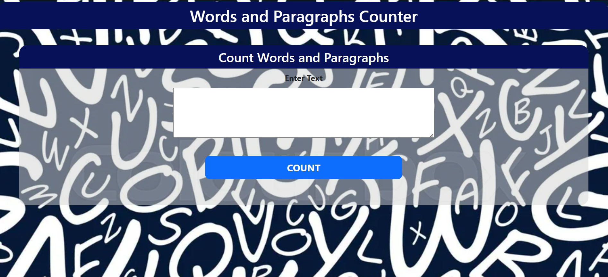

# Word,Paragraph and Charcter counter
This Flask web application provides a user-friendly interface for counting the number of words, paragraphs, and characters in a given text input. 
## Features

- **Word Count**: Counts the number of words in the input text.
- **Paragraph Count**: Counts the number of paragraphs (non-empty lines) in the input text.
- **Character Count**: Counts the number of characters in the input text, excluding carriage return and newline characters.

## Installation

1. **Clone the repository**:
    ```bash
    git clone https://github.com/your-username/word-paragraph-character-counter.git
    cd word-paragraph-character-counter
    ```

2. **Create a virtual environment**:
    ```bash
    python -m venv venv
    ```

3. **Activate the virtual environment**:
    - On Windows:
      ```bash
      venv\Scripts\activate
      ```
    - On macOS/Linux:
      ```bash
      source venv/bin/activate
      ```

4. **Install the required packages**:
    ```bash
    pip install -r requirements.txt
    ```

## Usage

1. **Run the Flask application**:
    ```bash
    python app.py
    ```

2. Open your web browser and go to `http://127.0.0.1:5000`.

3. Enter your text in the provided text area and click the "COUNT" button to get the word, paragraph, and character counts.

## File Structure

- `app.py`: The main Flask application file.
- `templates/index.html`: The HTML template for the web interface.
- `requirements.txt`: List of required Python packages.

## Example

Here's a screenshot of the application:



## Contributing

1. Fork the repository.
2. Create your feature branch (`git checkout -b feature/your-feature`).
3. Commit your changes (`git commit -m 'Add your feature'`).
4. Push to the branch (`git push origin feature/your-feature`).
5. Open a pull request.

Happy coding!
